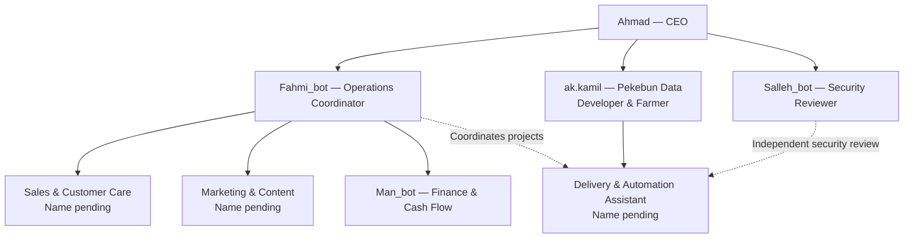

# Company agent organisation

Robot People Industries develops agentic systems for companies. This document records the planned leadership structure, functional roles and confirmed display names. It is an organisation plan; deployment and runtime renaming are separate changes.

## Organisation chart

Solid arrows show proposed reporting relationships. Dotted arrows show coordination or review.

## Role registry

| Stable role ID | Display name | Responsibility |
| --- | --- | --- |
| leadership.ceo | Ahmad | Strategic direction, priorities and business performance. |
| human.technical-lead | ak.kamil — Pekebun Data | Human Developer & Farmer; technical design, delivery guidance, farming expertise and practical validation. |
| ops.coordinator | Fahmi_bot | Coordinate work, prepare daily priorities, track commitments and escalate blocked tasks. |
| revenue.sales | Pending | Organise enquiries, qualify leads and prepare follow-ups, appointments and proposals. |
| growth.marketing | Pending | Prepare campaigns, content and customer evidence for review. |
| delivery.engineering | Pending | Assist ak.kamil with implementation, testing, documentation and support. |
| finance.cashflow | Man_bot | Track collections and costs, prepare cash-flow forecasts and flag overdue invoices. |
| security.review | Salleh_bot | Review security evidence and recommend remediation independently of delivery. |

Alan_bot and Hafeez_bot were both requested for Marketing & Content. Their final assignment needs clarification. Neither name is assigned to Sales without confirmation.

## Identity transitions

- Salleh_bot is the planned new display name for the security role previously called Abu. Existing `agents/abu/` files and Abu-labelled workflows remain the current implementation until a reviewed migration.
- Fahmi_bot is a distinct Operations Coordinator; Ahmad retains the CEO role.
- The legacy ALI/Marketer responsibilities are intended to be consolidated under Marketing & Content after its name is confirmed.
- ak.kamil leads technical delivery alongside operations coordination, supported by the Delivery & Automation assistant.
- Hermes is an execution runtime in this plan; it is not an additional business reporting role.

## Operating boundaries

A display-name change does not grant permissions, change credentials or transfer approval authority. Stable role IDs preserve history when names change. Role changes require review of tools, memory access, responsibilities and tests.

Existing named-human approval requirements remain in effect. An agent's CEO title does not replace human approval for publishing or authorise payments, credential changes or production releases. Salleh_bot starts read-only and cannot approve its own remediation.

n8n executes deterministic steps, PostgreSQL records state and approvals, and Odoo is the intended commercial system of record. A role definition does not prove its integrations are deployed.

## Build priorities

Start with bounded Sales, Delivery and Finance workflows. Fahmi_bot provides a concise coordination brief, Marketing supports the selected commercial offer, and Salleh_bot reviews operational evidence. Add autonomy only after functional tests, recovery checks and explicit action policies are verified.
